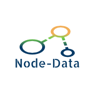

[](https://travis-ci.org/ratneshsinghparihar/Node-Data)
[](https://bestpractices.coreinfrastructure.org/projects/1459)
[](https://beta.gemnasium.com/projects/github.com/ratneshsinghparihar/Node-Data)
[](https://app.fossa.io/projects/git%2Bgithub.com%2Fratneshsinghparihar%2FNode-Data?ref=badge_shield)
[](https://badge.fury.io/js/nodedata)
[](https://www.npmjs.com/package/nodedata)
[](https://www.npmjs.com/package/nodedata)
## What is Node-Data 


Node-Data is unique backend framework which provides a generic interface for sql , NoSQL and graph entities and creates generic rest level 3 endpoints along with data repositories . 

A node-data user just define a model, provide an specification (sql ,nosql or graph) and node-data provides a API to write generic transaction and queries from  persistent layer .

Node-data automatically create rest end points over models and service written by user.
Node-data allows the relationships (one to one , manyto one etc ) with any kind of model , so essentially it allows a sql entity to have a no-sql document and vice versa . The consistency managed by framework and developers can treat all model as one type.

Node-Data is a Node.js framework to expose rest data on level 3 (metadata and auto discovery).

This framework will allow declarative style (annotations) to handle most of backend concerns (data relations, transactions, rest, graphql , security) .Yes its on javascript .

The target consumers are nodejs based scale projects looking for rewrite/new.

When you write for scale you might missed important aspect which might give you headache if you add the aspect late in your project. Node-Data will have most of aspects required in modern web scale project which can be enabled anytime using only annotations.

Rest level 3 is an amazing protocol allows the autodiscovery of system and application developers can write infrastructure for their code if backend api is level 3.

## What backend concerns will be handled

1. Rest level 3 APIs

2. Model driven system
 
3. Data repositories(Only interface)
 
4. Auto rest end point generations from repositories
 
5. Relations using annotations (onetoone , onetomany , manytoone , manyttomany)
 
6. Embedded relations support (replication)

7. Transaction and services using annotations

8. DI container

9. Caching second level
  
10.  Search and count (inbuilt elastic search)(repository and query dsl)
  
11.  Logging and auditing using annotations
  
12. Graphql support
  
13.  Meta-data API
  
14.  Security (inbuilt authentication) ,role based autherization , acl

15. Everythingh is promise (no callback hell)

16. Validation


## Technologies used 

library |  version |  Comment/alternative
------------ | ------------- | -------------
nodejs |  5.7.0 | node
express | 4.13.3 | Rest middleware
TypeScript | 1.8.4 | Rest middleware
monogdb | 2.1.3 | Documetndb , nosql , auto sharding
Mongoose | 4.3.5 | ORM for mongoDB
Metadata-reflect | 0.1.3 | For reflection and metadata
gulp | 3.9.0 | Compiling Typscript and Build process
passport | 0.2.2 | Authentication , sso , OAtuh , jwt token
Npm-acl | 0.4.9 | Popular acl library
Elastic search | 10.1.3 | Search and aggregation
Mongosastic | 4.0.2 | Library for integrating Mongoose with ElasticSearch
redis | unknown | Rest middleware

## Quick Start

Assumptions - 
1. mongodb is installed and server is running on default port.
2. Node 6.9.0 is installed.

Please follow belos steps to check CRUD operations with nodedata
1. git clone https://github.com/ratneshsinghparihar/nodedata-demo-sample.git
2. cd nodedata-demo-sample/Demo-Sample
3. npm install 
4. npm start
5. Post a JSON {"name": "testBlog"} to http://localhost:9999/data/blogs
6. Hit the api to get data(http://localhost:9999/data/blogs)
7. Hit the api with put method http://localhost:9999/data/blogs/{{blogId}}  with body {"name": "testBlog1"}
8. Hit the api with delete method http://localhost:9999/data/blogs/{{blogId}}

## How To Use with security

Follow the below steps to start using the framework.

1. Git clone https://github.com/hariadk/demo-sample.git

2. cd demo-sample/Demo-Sample

## Create a new user
1. POST {
"user":{"name":"a111","password":"a"}
}
in http://localhost:9999/register.
This will create a new user in db.

2. Now we can use this user information to login, for both session based and token based authentication

3. If we need to change the logic for user creation, change the method getNewUser in current-user-detail-service.ts file.Sample code is in place.

For using session based authentication use below steps:

1. Do above steps 1 & 2

2. Checkout branch PasswordAuth

3. npm install

4. tsd install

5. Mongodb running on 27017(default port).

6. Post a JSON {"name":"john","":"john"} to http://localhost:9999/data/users. This will create a test user in db.

7. open cmd, run 'gulp compile-ts' then run gulp.

8. Hit http://localhost:9999 which will take you to login page.

9. use john as username and password, and a session will be created.

For using Token based auth use below steps

1. All the steps done above except checkout branch TokenAuth.

2. Once logged in , a token will be created.

3. To change the token expiring time, change the file security-config.ts.
 public static tokenExpiresInMinutes: number = 2;//2 minutes
 
4. The number indicates minutes of token expiry not hours.


## Rest level 3 APIs

Node-data exposes the entities as level 3 REST APIs in HAL format. 
Read more about: 
[HAL specification] (http://stateless.co/hal_specification.html) 

[Rest API levels] (http://martinfowler.com/articles/richardsonMaturityModel.html) 
 
In short, REST level 3 in addition to HTTP verbs(get, put, post etc.) introduces the concept of discoverability. 
When we navigate to the base-url(assuming base-url for API is "http://localhost:8080/data/") for API, we get all the exposed rest APIs in the system. 
```json
[ 
  { 
   "roles": "http://localhost:8080/data/roles" 
  }, 
  { 
   "users": "http://localhost:8080/data/users" 
  } 
] 
```
 
### Suppose we want to get all the users in the system, we go to: "http://localhost:8080/data/users". 
```json
{ 
  "_links": { 
   "self": { 
    "href": "http://localhost:8080/data/users" 
   }, 
   "search": { 
    "href": "http://localhost:8080/data/users/search" 
   }, 
   "action": { 
    "href": "http://localhost:8080/data/users/action" 
   }  
  }, 
  "_embedded": [ 
   { 
    "_id": "56d692a24043588c0c713564", 
    "email": "alex.b@xyz.com", 
    "name": "Alex Brown", 
    "_links": { 
     "self": { 
      "href": "http://localhost:8080/data/users/56d692a24043588c0c713564" 
     }, 
     "roles":{ 
      "href": "http://localhost:8080/data/users/56d692a24043588c0c713564/roles" 
     } 
    } 
   }, 
   { 
    "_id": "56d692be4043588c0c713565", 
    "email": "daniel.j@xyz.com", 
    "name": "Daniel Jones", 
    "_links": { 
     "self": { 
      "href": "http://localhost:8080/data/users/56d692be4043588c0c713565" 
     }, 
     "roles":{ 
      "href": "http://localhost:8080/data/users/56d692be4043588c0c713565/roles" 
     } 
    } 
   } 
  ] 
} 
```

If we want to fetch all the roles for any user, we can simply fetch the roles url from inside the "_links" object for the given user. We just need to know what the base URL is, and after that we just follow the links to get any entity, its relations and so on. 

## Model driven system  

A model driven system allow one to build a solid backend by defining model . Convention approach enables developers to define specification on models and those specifications can be execute by framework or implemented by developer it self .  
 
```typescript
@document({ name: 'students', strict: Strict.true })
export class StudentModel {
    @field({ primary: true, autogenerated: true })
    _id: Types.ObjectId;

    @field()
    name: string;

    @field()
    age: number;

    @field()
    gender: string;

    @onetomany({ rel: 'courses', itemType: CourseModel, embedded: true })
    course: CourseModel.CourseModel;
    }
``` 
Here the Student Model has attribute is decorated with document with name student which will tell the system to persist each Student Model as a document with name student and schema will be restricted.

@Field will provide the specification for fields in model like primarykey , string field etc. @oneToMany annotation will build a embedded relation with couseModel in the system.

## Data repositories (Only interface)
 
Data repository exposes the basic CRUD operations for a defined model which can be used anywhere in application whether services or controllers. It also allows rest path definition and  authorization settings using attributes. The framework will automatically create the implementation of the interface which can be overridden by developer if required.

```typescript
@repository({ path: 'blogs', model: BlogModel })
export interface BlogRepository extends dataRepository {
	findByName();
    doPublish();
}
```
Here the basic CRUD operations (findone , finadall , save , saveall , delete,page) will be provided by dataRepository. custom methods can be define here and will be immplemented in services.

## Unit of work
Once a model and its repository is ready , following code can be written
```typescript
 let newCity = new city();
 newCity.name = name;
 newCity.post().then((sucess) => resolved(sucess));
 newCity.put().then((sucess) => resolved(sucess));
```
 
## Auto rest end point generations from repositories 
 
Once the repository interface defined the framework will automatically generates the rest point . In otherward as a developer you don't need to create the controllers. 

like for above BlogRepository the framework will generate and handle following automatically

```html
findOne
Get http://localhost:8080/data/blogs/1/
findAll
Get http://localhost:8080/data/blogs/
create
Post http://localhost:8080/data/blogs/
update
Put http://localhost:8080/data/blogs/1/
delete
Delete http://localhost:8080/data/blogs/1/

```

for Custom methods the framework will generate and handle url like

```html
http://localhost:8080/data/blogs/search/findByName?name=testblog
http://localhost:8080/data/blogs/searchAll?name=testblog
http://localhost:8080/data/blogs/action/doPublish/
```
 
If custom logic need to be added or entire repository action (like save) need to overridden then a service can be created for the custom logic and service method invocation can be done by defining in attribute over the respective repository's method like below (here we want to do logging after the save) 
 
 ```typescript
@PostAuthorize("@currentUserAutherizationServiceImpl.logSavedEntity(principal, returnObject)") 
<S extends T> S save(S entity); 
```
 
## Relations using annotations (one to one , onetomany , manytoone , manyttomany)
 
Relations between models can be established by adding following declarations. To explain we will be using following entities. 
 
  ```typescript
@document({ name: 'subjects', strict: Strict.true }) 
class SubjectModel { 
    @field() 
    name: string; 
} 
  
@document({ name: 'students', strict: Strict.true }) 
class StudentModel { 
    @field() 
    name: string; 
} 
  
@document({ name: 'teachers', strict: Strict.true }) 
class TeacherModel { 
    @field() 
    name: string; 
} 
```

### OneToMany 
One-to-many refers to the relationship between two entities A and B in which an element of A may be linked to many elements of B, but a member of B is linked to only one element of A.  
  
For instance, think of A as mentor, and B as student. A mentor can have several students, but a student can have only one mentor. Following code snippet establish this relation on Teacher entity. 
 ```typescript
@document({ name: 'teachers', strict: Strict.true }) 
class TeacherModel { 
    @field() 
    name: string; 
    @onetomany({ rel: 'students', itemType: StudentModel, embedded: false }) 
    mentoring: Array<StudentModel>; 
} 
```

We have different keywords while declaring the relation. These keywords are used in all the declaration. They are explained as below: 
Name 
Description 
Rel 
Set document name to which this property is mapped to  
itemType 
Set Entity type to which property is mapped to 
embedded 
Set to true will embed whole document as property value otherwise only primary key will be set as property value 
 
### ManyToOne 
Many-to-one is vice-versa implementation of one-to-many relation. It’s just that entity is present on other end.  
We will use example from OneToMany example and add that relation on Student entity. 
 ```typescript
@document({ name: 'students', strict: Strict.true }) 
class StudentModel { 
    @field() 
    name: string; 
    @manytoone({ rel: 'students', itemType: TeacherModel, embedded: false }) 
    mentor: TeacherModel; 
} 
```

### OneToOne 
One-to-one refers to the relationship between two entities A and B in which one element of A may only be linked to one element of B, and vice versa.
For instance, think of A as teacher, and B as subject. A teacher has only one subject, and a subject is taught by only one teacher. Following code snippet establish this relation on Teacher entity.
 ```typescript
@document({ name: 'teachers', strict: Strict.true })
class TeacherModel { 
    @field() 
    name: string; 
    @onetoone({ rel: 'subjects', itemType: SubjectModel, embedded: false })
    subject: SubjectModel; 
}  
```

### ManyToMany
Many-to-many refers to the relationship between two entities A and B in which A may contain a parent record for which there are many children in B and vice versa.
For instance, think of A as Student, and B as Subject. A student can have several subjects, and a subject can be taken by several students. Following code snippet establish this relation on Student entity.
 ```typescript
@document({ name: 'students', strict: Strict.true })
class StudentModel {
    @field()
    name: string;
    @manytomany({ rel: 'subjects', itemType: SubjectModel, embedded: false }) 
    subjects: Array<SubjectModel>;
}
```

## Embedded relations support (*replication*)
A relation can be saved two ways: 
1. Link to the related document 
2. Embed the related document 
Embedding document helps to get the object and relational data using single query from database thus reducing the database/server hits. This behaviour is managed by using ‘embedded’ keyword. When set to true, it fetches the document and embed whole document into the property. In this case, document is replicated and managed by the system. All the embedded document’s update/delete will automatically update the parent document. 
  
*For embedded, please make sure that there is no circular embedding into the system. Although system checks for any circular embedding of the object and throws error.* 

 
Transaction and services using annotations - (Not Yet Implemented) 
At the moment, transaction is not supported. But eventually, we will support basic transactions using @transactional annotation.  
Refer to: [Website] (https://docs.mongodb.org/manual/tutorial/perform-two-phase-commits/) for mongodb transaction. 
  
## DI container
 
Node-data implements a light-weight annotation driven dependency-injection container. All the services(@service) and repositories(@repository) can be injected in other classes. Construction injection (only for services) and property injection are supported currently. To inject the dependency, use the annotation @inject. @inject takes optional "type" parameter. When type cannot be inferred from the usage (interface or other types), we can pass the "concrete" type as a parameter to inject. 
Currently, we support concrete types only. If anyone wants to use interfaces, check out [Website] (http://inversify.io/) for more. 

*Usage*
 ```typescript
@service({singleton: true}) 
class MyService{ 
... 
} 
```
*Inject dependency in another service(constructor and property)* 
 ```typescript
@service() 
class MyAnotherService{ 
@inject() 
private myServiceAsProp: MyService; 
 
// constructor injection 
constructor(@inject() myService: MyService){ 
} 
} 
```

*Inject dependency in any another class(only property injection as of now)*
 ```typescript
class MyNormalClass { 
@inject() 
private myService: MyService; 
@inject() 
private myAnotherService: MyAnotherService; 
}
```
 
## Caching second level 
The proposal for caching is like below
```typescript
@document({ name: 'courses', strict: Strict.throw })
@cache({expirtion: Policy.Update ,concurrencyStrategy:Strategy.Read_Write })
export class CourseModel {
    @field({ primary: true, autogenerated: true })
    _id: Types.ObjectId;

    @field()
    name: String;

    @onetomany({ rel: 'teachers', biDirectional: true})
    @cache
    teachers: Array<TM.TeacherModel>;

    @manytomany({rel: 'students', biDirectional: false})
    students: Array<SM.StudentModel>;
}
```
In above example the courses in the system will be cached as per policy and concurrency defined . if you look for teachers for a course that will be served by the cache but if you look for students for a course that will come from persitent in lazy loading manner.

The choice for Caching (Redis , memcahed ,local) and its setting can be define in config.ts file.
 
## Search and count (inbuilt elastic search)(repository and query dsl) 

### Searching 
Searching is done on MongoDB by default. 
Provision is made to search using elasticsearch by changing the settings in the Config file. 
Search on elasticsearch is currently done only on fields that are indexed in the elasticsearch. 
All the search methods are needed to be exposed on the Repository. 
Currently only the "And" search operations are supported. 

Search on all documents can done using following


http://localhost:999/data/repository_name/searchAll?limit=10& skip=10&sort=fieldname&order=desc&gt=fieldname&gt_value=1510823040

limit= for top or bottom no of records
skip= no of dcouments to skip

sort= field upon which sorting needs to be done
order= ascending ot descending

lt=fieldname for less than comparision
lt-value=value-to-be-compared


gt=fieldname for greater than comparision
gt-value=value-to-be-compared (Number)

lte=fieldname for less than equal comparision
lte-value=value-to-be-compared (Number)


gte=fieldname for greater than comparision
gte-value=value-to-be-compared (Number)
 
### Configuring ElasticSearch: 

### Installation:
Elastic search can be installed from https://www.elastic.co/
### Config Class:  
Set "ApplyElasticSearch" to true to enable ElasticSearch 
Set the path of the ElasticSearch service at "ElasticSearchConnection" 
 
### Model Class:  
For all the fields where the ElasticSearch indexing is requried, set the property in "@field" as "searchIndex:true" 
e.g. As in the "name" and "age" properties, the searchIndex is set to true. 
 ```typescript
class PersonModel { 
    @field({searchIndex : true}) 
    name: string; 
 
    @field() 
    lastname: string; 
 
    @field({searchIndex : true}) 
    age: number; 
 
    constructor(){ 
    }
} 
```

### Configuring Search:  
All the search methods are defined at the Repository classes. 
Currently the methods are needed to be defined in a fixed format.  
The method name should start with "findBy".  
It should then be followed by all the fields that are needed to be searched joined by "And" 
 
e.g. 
 ```typescript
class PersonRepository { 
    findByName() { 
    } 
    findByNameAndAge() { 
    } 
    findByNameAndLastname(){ 
    } 
} 
```
 
### How the search happens: 
 
The API's are defined in such a way that if ALL of the fields to be searched are indexed, then the data is fetched from ElasticSearch. 
If any one the fields to be searched is NOT indexed in ElasticSearch, the data is fetched from MongoDB. 
Let us consider the above mentioned "PersonModel" and "PersonRepository" 
The methods "findByName" and "findByNameAndAge", queries using the fields "name" and "age". Since they are defined as Indexed, the data will be fetched from ElasticSearch. 
The method "findByNameAndLastname", queries "name" and "lastname". Since "lastname" is not defined as indexed, the data will be fetched from MongoDB. 


## Logging 

It will be completely on developers hand , The framework will allow the metadata of a class , method with logging attribute to be accessible to developers.
User can also inject the logger using DI.
 ```typescript
class Calculator{
	@log
    add(a: number, b: number){
    	return a + b;
    }
}
```

## Auditing
The proposal for Auditing is @Audit attribute which can be applied over model or over repository or in both.
```typescript
@Audit({auditModel: CourseAuditModel})
export class CourseModel {
}
```
If appllied over model then developer needs to create a audit schema model similar to current model , remove any non auditable field and add audit fields (createdby, lastmodifiedby, deletedby, createddate, lastmodifieddatae) (or extend from). then this new audit schema model need to be passed as a parameter in attribute. If no schmea is provided then framework will autmatically create audit schema including all columns.

```typescript
@repository({ path: 'blogs', model: BlogModel })
export interface BlogRepository extends dataRepository {
    @Audit
	save();
}
```
If appllied over repository then all write opertation will be audited in a dedicated document for the model.


## Optimistic Locking
The docuement databases are infamous for concurrent updates . in high concurrency the situation multifolds itself. we are proposing a simple mechanism of optimatic locking by decorating the suspected method on repository by
You need to add version property in your model like below
```typescript
@jsonignore()
    @field()
    __v: any;
```
Once above field is added in model then you can apply optimistic locking in below way on repository methods like put,patch etc ..
```typescript
@OptimisticLocking(type = OptimisticLockType.VERSION)
put()
```
in other to support it the corresponding model should have a column decorated with @version attribute
```typescript
@Version
@JsonIgnore
@field(name = "version")
version: int;
```
@version attribute could be applied to int , date fields. Once this is done , for every write query the version check will be apllied hence if somone has stale data it won't be allowed to write.

## Graphql support 
For Graphql, atrribute over the  Model will enable the graph queries to be executed.like 
```typescript
@document({ name: 'users', strict: Strict.true }) 
@Graphql
class UserModel { 
    @field() 
    name: string; 
    @manytomany({ rel: 'friends', itemType: FreindModel, embedded: true }) 
    friends: Array<FriendModel>; 
} 
```
Once define like above the framework will automatically add GraphqlObjectType and GraphqlSchema.

Example GraphQL query (request body for post on /user/grpahql/):
```javascript
user(id: "1") {
  name
  friends {
    name
  }
}
```
Example response:
```json
{
  "data": {
    "user": {
      "name": "John Doe",
      "friends": [
        {
          "name": "Friend One"
        },
        {
          "name": "Friend Two"
        }]
      }
    }
  }
  ```
Example GraphQL mutation:
```javascript
mutation updateUser($userId: String! $name: String!) {
  updateUser(id: $userId name: $name) {
    name
  }
}
``` 
## Meta-data API

Metadata gives the structure of the object. The structure consists of the properties defined in the entities. 

For e.g. ‘http://localhost/metadata’ will return all the objects metadata : 
```json
{ 
  "_links": [ 
    { 
      "name": "subjects", 
      "metadata": "http://localhost/Metadata/subjects" 
    }, 
    { 
      "name": "students", 
      "metadata": "http://localhost/Metadata/students" 
    }, 
    { 
      "name": "teachers", 
      "metadata": "http://localhost/Metadata/teachers" 
    } 
  ] 
} 
```  
Further running ‘http://localhost/Metadata/students’ will give:
```json
{ 
  "id": "students", 
  "properties": [ 
    { 
      "name": "name", 
      "type": "String" 
    }, 
    { 
      "name": "subjects", 
      "type": [ 
        "http://localhost/Metadata/subjects" 
      ] 
    } 
  ] 
} 
```
For primitive types, name of the type is shown.  If the entity has a relationship with another entity then the link of that object's metadata is shown. 
 
## Security (inbuilt authentication) ,role based autherization , acl 
 
### System has two types of inbuilt authentication:  
1. *Session based* 
2. *Token based* 
 
### Session based 
It takes the username and password from a user, validates it against the user document in the mongodb. If user is found it creates a session for it. 
To use this a user needs to edit the config.ts file. 
```typescript
export class Security { 
    public static isAutheticationEnabled: boolean = true; 
    public static isAuthorizationEnabled: boolean = false; 
    public static isAutheticationByUserPasswd: boolean = true; 
    public static isAutheticationByToken: boolean = false; 
} 
```
Both isAutheticationEnabled  and isAutheticationByUserPasswd should be set to TRUE.  
isAutheticationByUserPasswd  and  isAutheticationByToken are mutually exclusive.   
 
### Token Based 
It takes the username and password from a user, validates it against the user document in the mongodb. If user is found it creates a token and a refreshToken for that user, and stores in user document itself. Session is not created in this case.  
The token expiry time can be set in security-config.ts file. 
 ```typescript
public static tokenExpiresInMinutes: number = 2;//2 minutes. 
```
The token is set in the cookies and sent to the browser.Using that token, user is considered valid, and provided access to the system. 
Once the token is expired, user can just hit the /token API with refreshToken as the query param. RefreshToken value can be found in the browser cookies. This API will generate a new token for the user, and replace the old token in the user document in the DB, as well as in the cookies. Using the new token user can access the system again, without having to login again and again. 
 
To enable token based authentication just edit the config.ts file in following manner 
```typescript
export class Security { 
    public static isAutheticationEnabled: boolean = true; 
    public static isAuthorizationEnabled: boolean = false; 
    public static isAutheticationByUserPasswd: boolean = false; 
    public static isAutheticationByToken: boolean = true; 
} 
```
Currently any user who is AUTHENTICATED, has access to the entire DB. This is because, AUTHORIZATION is not implemented. In the absence of authorization, the user has access to every document in the db. 

### FaceBook Authentication(SSO) 

Facebook authentication uses facebook to authenticate a user. If the user is present in the db, it stores the token in the user document and creates a session for the user in the application. In case its a new user, it first creates the user in the DB and then creates a session for the user in the application. 
To enable it the only thing needs to be done is in the config.ts file. 
```typescript
export class Security {
    public static isAutheticationEnabled: boolean = true;
    public static isAuthorizationEnabled: boolean = false;
    public static isAutheticationByUserPasswd: boolean = true; 
    public static isAutheticationByToken: boolean = false; 
}
```

## Everything is promise (*no callback hell*)
Callback-Hell in nodejs occurs when we have multiple levels of callbacks(as shown in the sample below). This severely affects readablitly of the code. Node-data internally uses [Q](https://github.com/kriskowal/q/wiki/API-Reference) to wrap the function calls and returns a promise. Using Promise chains flattens the pyramid and the code is cleaner.
 ```typescript
 return Q.nbind(this.find, this)(params)
        .then(result => doSomething(params1))
        .then(result => doSomethingElse(params2))
        ...
        .catch(error => Q.reject(error))
 ```
Instead of (Callback hell):
```typescript
this.find(params, (error, data) => {
	doSomething(params1, (error, data) => {
		doSomethingElse(params2, (error, data) => {
			...
		});
	});
})
```

## Validation
Proposal is to create a validation service where annotations will be used to validate required attributes in any entity.

For example check below code fragment

```typescript
class UserModel { 
    
    @field() 
    @NotNull() // to ensure that this attribute is never null
    name: string;   
    
    @field() 
    @number() // to ensure that this attribute is integer
    age: number; 
    
    @field() 
    @email() // to ensure that this attribute is in mail format
    email: string; 
    
    @field() 
    @length(10) // to ensure that this attribute is not having more than 10 char, and all char are numbers
    mobileNumber: string; 
    
    @field() 
    @min(10)
    @max(20)// to ensure that this attribute is not more than 20 and not less than 10
    count: number;      
} 
```

The user will have freedom to choose the entity attribute to be validated before save or update.

## statistics/count API
Further running ‘http://localhost/statistics/students’ will give:
```json
{ 
  "id": "students", 
  "properties": [ 
    { 
      "name": "count", 
      "type": "number",
      "value":15
    }
  ] 
} 
```
Further running ‘http://localhost/statistics/’ will give:
```json
[{ 
  "id": "students", 
  "properties": [ 
    { 
      "name": "count", 
      "type": "number",
      "value":15
    }
  ] 
},
{ 
  "id": "teachers", 
  "properties": [ 
    { 
      "name": "count", 
      "type": "number",
      "value":5
    }
  ] 
},
] 
```
where condition is supported

## Diffrence between waterline and Node-Data
The waterline is a greate opensource porject and has been an inspiration for us but there is a big difference between Node-data and waterline . The Node-Data is not an another ORM , its a wrapper over famous ORMs like(mongoose , seqlize , neo4j) . Node-Data provides an abstraction over these famous ORMs so that Developer don't have to deal with them individually and they can write models and transaction over these ORMs with same codebase. 

## pure js project supported
Node-data now is fully supported inside a normal js project , no typescript dependency (check BMMaster branch for template)

## bulk and performance improvements
## Entity Manager
Entity action manager will help you to write your business logic codes in a controlled environment. By controlled environment we mean that developer should have the control on before and after of any transcation to the system. Let take an example for our better understanding.

Suppose we are doing a transcation to add a new student in the system and we are maintaing a total count of students in the class. So in this case, we would have written a code to update total student count after creating a new student.
```
function addAndUpdate(){
  studentRepo.post(newStudentObj).then(success => {
	 // update total students cont in school
     classRepo.put({_id: "5a24fc4d485fcd66084863e2", totalStudentCount: curTotalStudentCount + 1});
   });
}
```
So problem with this code is we have to call addAndUpdate() method manually to work correctly. But imagine a new developer came and created a new student by simply calling studentRepo.post(newStudentObj); and he might forget/(dont know) to update the total student count in class.

In this scenario Entity Manager will make sure that a common business functionality should always execute on a transcation by overriding its postCreate() method. postCreate() method will always execute after any create (post) on the system. 

```
postCreate(params: EntityActionParam){
	classRepo.put({_id: "5a24fc4d485fcd66084863e2", totalStudentCount: curTotalStudentCount + 1});
    return super.postUpdate(params);
}
```

How to enable Entity Manager feature in your project:
1. extend/inherit your repository class from AuthorizationRepository and override the entity action methods
Entity Action methods:-
preUpdate

postUpdate

preBulkUpdate

postBulkUpdate

preRead

postRead

preBulkRead

postBulkRead

```typescript
preUpdate(params: EntityActionParam): Q.Promise<EntityActionParam> {
        return Q.resolve(params);
    }

postUpdate(params: EntityActionParam): Q.Promise<EntityActionParam> {
        return Q.when(params);
    }
export interface EntityActionParam {
    inputEntity?: any;
    oldPersistentEntity?: any;
    newPersistentEntity?: any
}    
```   
## Transaction 
   no transaction on documents(@document) side , @transaction is supported on sql entities(@entity) repositories
   if calling a document transaction within a method with @transaction , it will not rollback and developer need to handle this.
## process control
```typescript
    @processStartEnd({ action: "importLead", type: "project", indexofArgumentForTargetObjectId: 1 })
    public read(filePath: string, projectId, toDelete?) {
    }
```
## Workers and Async Api
```typescript
    @worker()
    public read(filePath: string, projectId, toDelete?) {
    }
```
quick response with  
```json
{ 
  "id": "3423423",
  "processName":"",
  "status":"inprogress"
  "subscriptionProperties": [ 
    { 
      "channel_id": "3423", 
      "type": "pushnotification",
      "event_id":15,
      "action_id":16
    },
     { 
      "url":"http://localhost:8080/data/process/3dfgs3/",
      "token":"324324fsdfs32rfsd",
      "type": "rest",
      "metadata":{}
    }
  ] 
} 
```

## PUB-SUB using Messageing 
to define a repository to act like an pub-sub 
```typescript
@repository({ path: 'workerprocess', model: WorkerProcess, exportType: ExportTypes.PUB_SUB})
export class WorkerRepository extends DynamicRepository {}
```
This will use a database queue (persistent) for the repository and on evey transaction it will emit the messages to whoever is connected to database.

This pub-sub is reliable and persistent (not like pusher,redis pub-sub). 

To consume the message create a onMessage method on repo , insise this method you can receive all output to repo.
```typescript
export class WorkerRepository extends DynamicRepository {
     public onMessage(message: WorkerProcess) {
        if (message.status == "connected") {
            this.wps.addWorker(message);
        }
        if (message.status == "disconnected") {
            this.wps.deleteWorker(message);
        }
    }
}
```
In cases where high write operations are expected a dedicated queue might required for that set 
edicatedMessenger:true
```typescript
@repository({ path: 'workerprocess', model: WorkerProcess, exportType: ExportTypes.PUB_SUB, dedicatedMessenger:true})
export class WorkerRepository extends DynamicRepository {
}
```

## RealTime server using websockets
Node-Data supports real time communication to server using websockets.
first step is to tell server.js/app.js to create a socket server like below .
passing httpserver(express server or node native http server) (server like below) object in Main will turn the current http-server into socket server.
```typescript
Main(Config, securityConfig, __dirname, data.entityServiceInst, seqData.sequelizeService,server);
```
next is to tell a repository to expose websocket end point
```typescript
@repository({ path: 'workerprocess', model: WorkerProcess, exportType: ExportTypes.WS})
export class WorkerRepository extends DynamicRepository {}
```
If you need websocket and rest both on repo use it like below
```typescript
@repository({ path: 'workerprocess', model: WorkerProcess, exportType: ExportTypes.WS | ExportTypes.REST})
export class WorkerRepository extends DynamicRepository {}
```
Now just like rest end points from client side messages can be received and emitt real time using socket.io-client library (socket server will be hosted on web server  ws://localhost:8080 )

if repo is WS then every changes in the repo will be send to connected clients automatically.
security and acl will applied obiviously before sending.

## websockets security client side changes
All security reules applied to rest api are still applicable for webscoket apis
for authentication/autherization client need to send information like below
```typescript
const socket = io('ws://localhost:8080', 
    {transports: ['websocket', 'polling'],
    query: {
            name: "ui-test", netsessionid: "abc123", email: "ratneshp@talentica.com", phone: "+918600147266"
        }
}); 


```
if succeded then server will establise an uws session with client, client need to tell upfornt which channels (aka repo path) he want to listen
```typescript
const socket = io('ws://localhost:8080', 
    {transports: ['websocket', 'polling'],
    query: {
            name: "ui-test", netsessionid: "public", email: "ratneshp@talentica.com", phone: "+918600147266",
			channels:"workerprocess,order"
        }
}); 


socketio.on('workerprocess', function (data) {
        
        console.log("workerprocess message received-->", data);
    });

```
in order to send the messages back to server , action is repo's action ,heders will have security session token, message will have request body
```typescript
 socket.emit('order', {
                action: 'bulkPost',
                headers: { netsessionid: 'abc123' },
                message: [{ }]
            });
```
## websockets security for microservices and workers
other microservices and workers in ecosystem can also use  mechnism to client to send and receve messages,
for realiable messaging (like server restart or worker restart , pending messages should recieve again
```typescript
const socket = io('ws://localhost:8080', 
    {transports: ['websocket', 'polling'],
    query: {
            name: "ui-test", netsessionid: "public", email: "ratneshp@talentica.com", phone: "+918600147266",
			reliableChannles:"workerprocess,payment"
        }
}); 
```
## websockets security server side changes
security config file is responsible for telling the consumers what they can listen and what they can emit.

"acl": true will run acl code for each messages before sending to connected clients.

"acl": false will broadcast to all connected client under the role.

if there are multiple instance of worker(realiable channel) and only one should get message following settings helps
"emitToSingleWorker": true
```typescript
export class SecurityConfig {
    
    public static ResourceAccess: Array<IResourceAccess> = [
        {
            name: "worker",
            acl: [
                {
                    "role": "ROLE_USER",
                    "accessmask": 5,
                    "acl": true
                },
                {
                    "role": "ROLE_PUBLIC",
                    "accessmask": 1,
                    "acl": false
                },
                {
                    "role": "ROLE_WORKER",
                    "accessmask": 15,
                    "acl": false,
                  	"emitToSingleWorker": true
                }
            ],
            isRepoAuthorize: true
        }
      }
```
## why node-data coulde be a best fit for your next no-sql design
no-sql designs are continous process and node-data has been design to help developers to build right no-sql design and allow them to easily refactor the current modeling to next design . In most of the cases data migration don't create bottleneck on design changes , its the transaction code which stop the developer to rewrite them again , here node-data helps developers to refactor the code easily and allow them to build new experinces out of existing experinces with out so many breaking changes. 

for online support use gitter
https://gitter.im/node-data/node-data-support

for raising a ticket use jira
[JIRA URL] (https://node-data.atlassian.net/secure/RapidBoard.jspa?rapidView=2&view=detail) 


